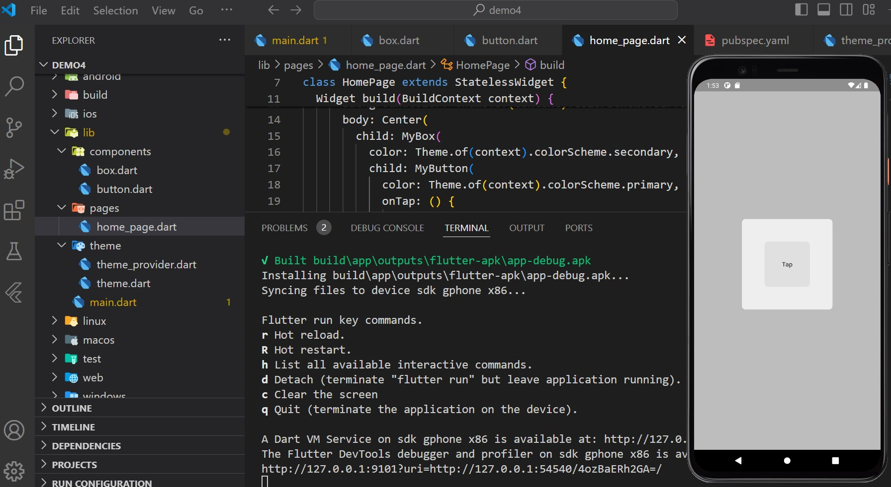
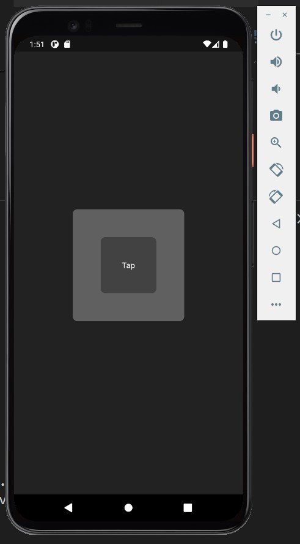

# Flutter Responsive Theme App

This is a demo Flutter application showcasing theme toggling using Provider.

## Table of Contents

- [Introduction](#introduction)
- [Screenshots](#screenshots)

## Introduction

This Flutter application demonstrates how to toggle themes using Provider package. It includes a `ThemeProvider` to manage themes across the app.

## Screenshots

Include screenshots or images of your application in action.

### Example 1: Light Theme

### Example 2: Dark Theme

